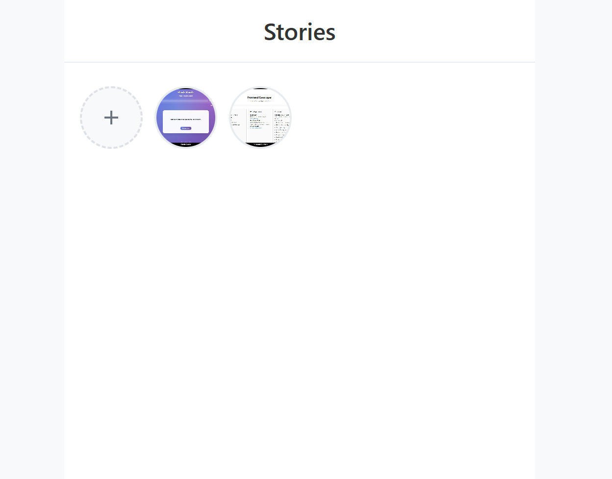

# Stories Feature

A client-side Stories feature similar to Instagram and WhatsApp, built with vanilla HTML, CSS, and JavaScript.



https://roadmap-project-ivyb.vercel.app/

## Features

- **Add Stories**: Click the plus button to upload images
- **Automatic Expiration**: Stories disappear after 24 hours
- **Progress Bars**: Visual progress indicators for each story
- **Swipe Navigation**: Swipe left/right to navigate between stories
- **Keyboard Navigation**: Use arrow keys and Escape to navigate
- **Responsive Design**: Works on desktop and mobile devices
- **Image Optimization**: Automatically resizes images to max 1080x1920px
- **Local Storage**: Stories are saved in browser's localStorage

## How to Use

1. **Open the Application**: Simply open `index.html` in your web browser
2. **Add a Story**: Click the plus (+) button and select an image file
3. **View Stories**: Click on any story thumbnail to view it
4. **Navigate Stories**: 
   - Swipe left/right on mobile
   - Use arrow keys on desktop
   - Click the navigation buttons
   - Press Escape to close

## File Structure

```
├── index.html          # Main HTML file
├── styles.css          # CSS styles
├── script.js           # JavaScript functionality
└── README.md          # This file
```

## Technical Details

### Image Processing
- Images are automatically resized to fit within 1080x1920px dimensions
- Maintains aspect ratio during resizing
- Converts to base64 for storage
- Supports JPEG, PNG, and WebP formats
- 10MB file size limit

### Storage
- Stories are stored in localStorage as base64 strings
- Each story includes creation and expiration timestamps
- Automatic cleanup of expired stories

### Responsive Design
- Mobile-first design approach
- Touch-friendly navigation
- Optimized for various screen sizes

## Browser Compatibility

- Chrome/Edge (recommended)
- Firefox
- Safari
- Mobile browsers (iOS Safari, Chrome Mobile)

## Local Development

To run the application locally:

1. Clone or download the files
2. Open `index.html` in your web browser
3. No build process or server required!

## Features in Detail

### Story List
- Horizontal scrollable list of story thumbnails
- Add story button with plus icon
- Circular thumbnails with hover effects

### Story Viewer
- Full-screen modal overlay
- Progress bars showing story duration
- 3-second automatic progression
- Manual navigation controls

### Navigation Options
- **Touch**: Swipe left/right on mobile
- **Keyboard**: Arrow keys for navigation, Escape to close
- **Mouse**: Click navigation buttons or outside to close
- **Auto**: Automatic progression every 3 seconds

## Customization

You can easily customize the application by modifying:

- **Colors**: Edit CSS variables in `styles.css`
- **Timing**: Change the 3-second duration in `script.js`
- **Image Limits**: Modify max dimensions in `script.js`
- **Storage**: Adjust localStorage key names if needed

## Performance Notes

- Images are compressed to reduce storage size
- Lazy loading for story thumbnails
- Efficient DOM manipulation
- Automatic cleanup prevents memory leaks

## Security Considerations

- Client-side only - no server communication
- File validation prevents malicious uploads
- Local storage limits prevent excessive data usage

- No external dependencies or libraries required 

