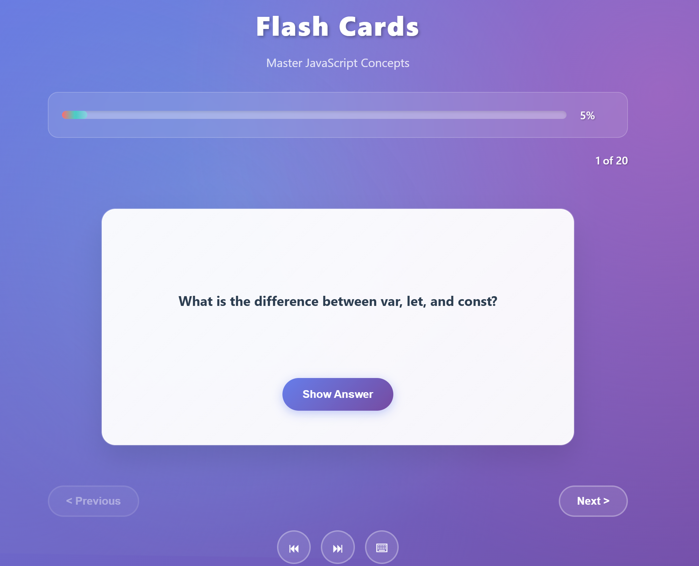

# FlashCards

## Goal

The goal of this project is to help you learn about how to use state management and component-based architecture using JavaScript frameworks. You will build a flash card app with pre-defined JavaScript questions and answers that users can flip through to test their knowledge.

## Requirements
You are required to develop a flash cards app with the following features:

- [X] Pre-defined flashcards with questions and answers
- [X] Progress bar to show the user’s progress
- [X] Ability to view flashcards one at a time and flip to reveal the answer
- [X] Simple navigation to cycle through the flashcards

[Flash Cards](https://roadmap.sh/projects/flash-cards)
