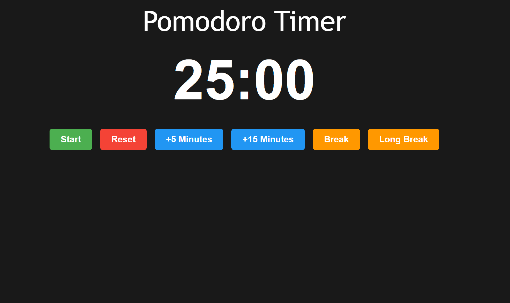

# Pomodoro Timer

## Goal

The goal of this project is to learn and practice frontend development skills by building a Pomodoro Timer, a productivity tool based on the Pomodoro Technique. The Pomodoro Technique is a time management method that uses a timer to break work into intervals (typically 25 minutes) separated by short breaks.

## Requirements

- [X] Use HTML, CSS, and JavaScript (or a frontend framework/library such as React, Vue, or Angular).
- [X] Implement state management for the timer and session tracking.
- [X] Use a modular and reusable code structure.
- [X] Maintain proper accessibility standards (e.g., keyboard navigation, ARIA labels).
      
[Pomodoro Timer](https://roadmap.sh/projects/pomodoro-timer)

https://roadmap-project-six.vercel.app/
