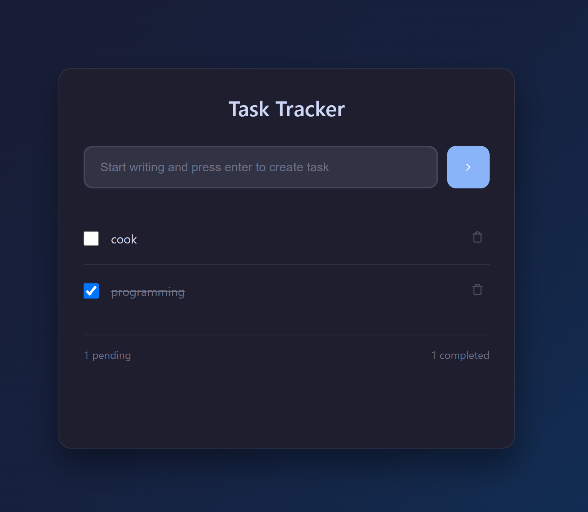

# Task Tracker

A modern, responsive task tracking application built with JavaScript, HTML, and CSS.


[Task Tracker](https://roadmap.sh/projects/task-tracker-js)

## Features

- ✅ **Add New Tasks**: Type in the input field and press Enter or click the add button
- ✅ **Mark Tasks Complete**: Click the checkbox to toggle task completion status
- ✅ **Delete Tasks**: Click the trash icon to remove tasks
- ✅ **Smart Organization**: Completed tasks automatically move to the end with strikethrough
- ✅ **Persistent Storage**: Tasks are saved in your browser's localStorage
- ✅ **Responsive Design**: Works perfectly on desktop and mobile devices
- ✅ **Modern UI**: Clean, beautiful interface with smooth animations

## How to Use

1. **Open `index.html`** in your web browser
2. **Add a task**: Type in the input field and press Enter
3. **Complete a task**: Click the checkbox next to any task
4. **Uncomplete a task**: Click the checkbox again to mark as incomplete
5. **Delete a task**: Click the trash icon on the right side of any task

## Technical Implementation

The application follows the requirements specified in the project:

- **Tasks Array**: All tasks are stored in an array of objects with properties for description, completion status, and creation date
- **Dynamic Updates**: The `renderTasks()` function clears the DOM and re-renders all tasks whenever the array changes
- **Event Handling**: Proper event listeners for adding, toggling, and deleting tasks
- **DOM Manipulation**: Dynamic creation and removal of task elements

## File Structure

```
Task Tracker/
├── index.html      # Main HTML structure
├── styles.css      # CSS styling and responsive design
├── script.js       # JavaScript functionality
└── README.md       # This file
```

## Browser Compatibility

- Chrome (recommended)
- Firefox
- Safari
- Edge
- Mobile browsers

## Local Storage

Your tasks are automatically saved in your browser's localStorage, so they'll persist between browser sessions. No data is sent to external servers.

## Getting Started

Simply open `index.html` in any modern web browser to start using the Task Tracker!

