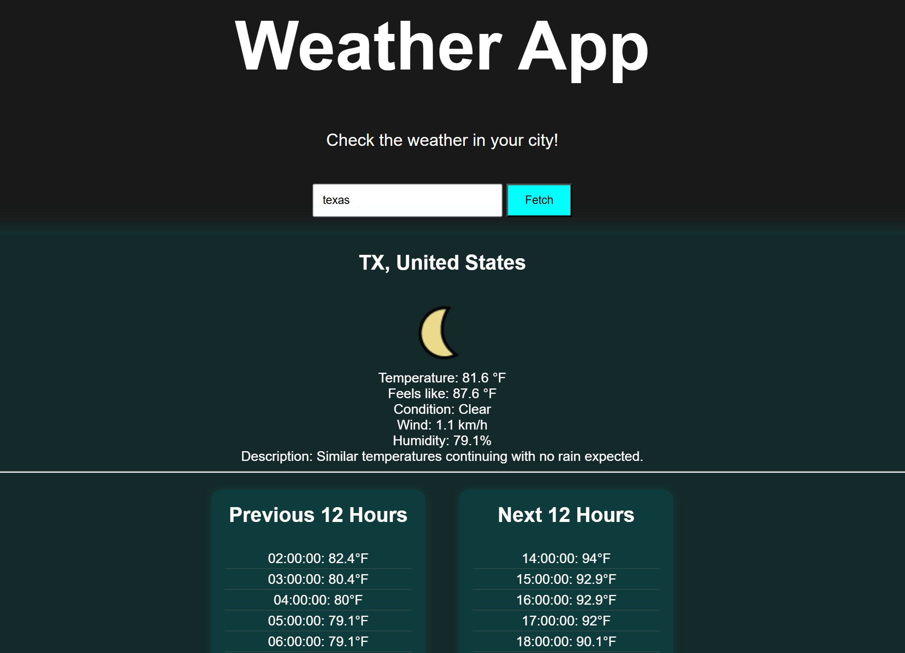

# Weather App

## Goal

In this project you are required to build a weather app that displays the current weather details based on the location entered by the user. We will be leveraging a common weather API to achieve this.

## Requirements

- [X] The User should be able to enter a location into an input field
- [X] The User will be presented with temperature, wind speed, likelihood of rain, and general weather i.e. Sunny, Raining, Cloudy etc.
- [X] The User will be shown the previous and future 24 hour periods.
- [X] The weather outlook can be refreshed by the user.
      
[Weather App](https://roadmap.sh/projects/weather-app)
